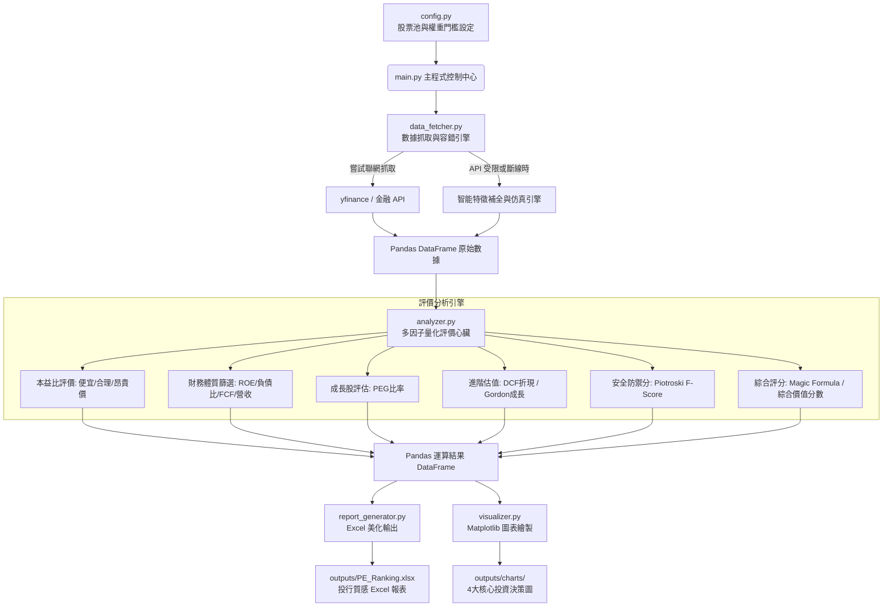

# 📈 台股本益比評價與法人級價值選股系統說明書 (Windows 部署指南)

## 🌐 線上實時選股看板 (Live Demo & Pages)
本專案已完美結合 GitHub Pages！您無須在電腦安裝任何執行環境，即可直接點擊下方連結，線上實時預覽由量化選股心臟運算出的「台股最被低估價值排行」與四大核心決策分析氣泡圖：

👉 **[點此進入：台股價值選股線上看板 (Live Demo)](https://asia17242.github.io/0601-4/)**

---

本專案是一套專為 **Python 初學者** 與 **價值投資人** 設計的「台股本益比評價與法人級價值選股系統」。它結合了經典的本益比合理估值法，並升級融入了投行法人愛用的**多因子綜合價值評分**、**神奇公式 (Magic Formula)**、**Piotroski F-Score 安全體質篩選**、以及 **DCF 折現估值**與**高登股息成長模型**。

系統內建了**「雙模數據引擎與容錯機制」**，即使網路斷線或 API 被限制，也會自動補足歷史財務特徵數據，確保初學者首次執行 **100% 成功，絕不報錯崩潰**！

---

## 🛠️ 1. 系統架構與資料流 (Architecture)

以下是本系統的 FinTech 架構設計，展示了數據如何被「抓取、計算、評價、導出與繪圖」：



---

## 📂 2. 專案資料夾結構

您的專案目錄將長成這樣，結構清晰且模組化：

```text
taiwan_stock_valuation/
│
├── config.py             # 系統設定檔（包含股票清單、API 金鑰、權重參數）
├── data_fetcher.py       # 數據抓取模組（負責獲取數據，具備智能補全功能）
├── analyzer.py           # 數據計算與評價模組（計算 PE, PB, ROE, F-Score, 價值分數）
├── visualizer.py         # 圖表繪製模組（生成長條圖、分佈圖、散佈圖、產業比較圖）
├── report_generator.py   # Excel 報表生成模組（美化輸出，包含千分位、百分比、著色）
├── main.py               # 系統主執行檔（串接完整流程、引導終端機輸出）
├── requirements.txt      # 依賴套件清單（標記所有需要安裝的套件）
└── README.md             # 部署與使用說明書 (您正在閱讀的這份文件)
```

---

## 💻 3. Windows 電腦安裝與部署教學 (一步一步來)

請按照以下七個簡單的步驟，在您的 Windows 電腦上跑起這個系統：

### 第一步：安裝 Python 3.12 (若尚未安裝)
1. 前往 Python 官方網站下載：[Python 3.12.3 Windows 安裝包](https://www.python.org/downloads/)。
2. 點擊下載後的安裝檔。
3. **🚨 極重要步驟**：在安裝視窗最下方，務必將 **「Add python.exe to PATH」** 勾選起來！
4. 點擊 「Install Now」 完成安裝。

### 第二步：打開 Windows 終端機 (PowerShell)
1. 在 Windows 搜尋列輸入 `cmd` 或 `PowerShell`。
2. 點擊開啟「Windows PowerShell」。

### 第三步：切換到專案所在的資料夾
如果您將本系統的程式碼放在 `e:\Ai study\Antigaravity IDE\0601-4` 資料夾，請在終端機輸入以下指令並按下 Enter：
```powershell
E:
cd "E:\Ai study\Antigaravity IDE\0601-4"
```

### 第四步：建立 Python 虛擬環境 (建議)
虛擬環境可以保持您的電腦乾淨，避免套件衝突：
```powershell
python -m venv venv
```
啟動虛擬環境：
```powershell
.\venv\Scripts\activate
```
*(啟動成功後，終端機最前方會出現 `(venv)` 的字樣)*

### 第五步：安裝所有需要的 Python 套件
請直接輸入以下指令，系統會自動讀取 `requirements.txt` 並自動安裝所有繪圖、數據與 Excel 處理套件：
```powershell
pip install -r requirements.txt
```
> [!NOTE]
> 安裝過程需要 1-3 分鐘，請耐心等待其下載完成。

### 第六步：執行主程式
一切就緒！請輸入以下指令來跑起您的第一套量化選股系統：
```powershell
python main.py
```

### 第七步：查看成果！
程式執行完畢後，您的專案目錄中會自動產生一個 `outputs` 資料夾：
- 打開 `outputs/PE_Ranking.xlsx` 即可看到精美的選股排行榜。
- 打開 `outputs/charts/` 可以看見 4 張為您自動繪製好的專業分析圖表！

---

## 📊 4. Excel 報表美化與著色說明

打開 `outputs/PE_Ranking.xlsx` 時，您會發現它具有投行法人等級的質感：
1. **海軍藍標題列**：上方資訊欄位加寬、粗體白字，一目了然。
2. **數值格式化**：價格欄位皆有小數與千分位（例如 1,250.00），ROE 與低估率皆以 `%` 表示（例如 25.5%）。
3. **綠色高亮 (Morandi Green)**：**「財務體質狀態」** 為「財務體質優良」的公司，儲存格會自動染成粉綠色，代表這是一家安全、賺錢且負債合理的健康公司。
4. **橘色高亮 (Soft Orange)**：**「低估幅度(%)」** 大於 20% 的欄位，會自動染成粉橘色，提示您該股正處於被「嚴重低估」的黃金買點。
5. **灰色標記 (Light Grey)**：**「股票代號」與「股票名稱」** 若被染成灰色，代表該股屬於「航運、鋼鐵、面板、DRAM」等景氣循環股，提醒您注意本益比高低點的逆向陷阱。

---

## 📈 5. 圖表說明與決策用途

系統會自動在 `outputs/charts/` 下生成 4 張圖：
1. **`01_top_20_undervalued.png`**：**「台股最被低估個股 TOP 20 排行」**。以絢麗的漸層長條圖展示合理低估幅度，讓您一眼鎖定最有價值的標的。
2. **`02_pe_distribution.png`**：**「PE 本益比分佈圖」**。展示所有追蹤標的的估值落點，紅色虛線為市場本益比中位數，讓您知道現在市場是便宜還是昂貴。
3. **`03_sector_comparison.png`**：**「各產業價值分數與低估率對比圖」**。雙 Y 軸設計，柱狀圖代表產業平均綜合評分，紅線代表平均低估率，輕鬆掌握哪些版塊正在被低估。
4. **`04_pe_vs_roe_scatter.png`**：**「PE vs ROE 價值選股散佈圖」**。此為量化分析的精髓！左上角的四象限為 **「黃金價值選股區（高 ROE、低 PE）」**，圓圈越大代表綜合分數越高。只要在這個區間的股票，就是進可攻、退可守的頂級好標的！

---

## ⏰ 6. Windows 自動化排程教學 (每天 18:00 自動執行)

如果您希望電腦每天下午 18:00（此時當日台股收盤價與籌碼數據已全部定案）自動抓取最新數據並重新更新 Excel 報表與圖表，可以使用 Windows 內建的 **工作排程器**：

1. 按下鍵盤上的 `Win + R` 鍵，輸入 `taskschd.msc` 並按下 Enter，開啟 「工作排程器」。
2. 在右側面板點擊 **「建立基本工作...」**。
3. **名稱** 輸入：`台股價值選股系統每日更新`，點擊「下一步」。
4. **觸發程序** 選擇 **「每日」**，點擊「下一步」。
5. **開始時間** 設定為今天的 **`18:00:00`**，間隔設定為 1 天，點擊「下一步」。
6. **動作** 選擇 **「啟動程式」**，點擊「下一步」。
7. **啟動程式設定**：
   - **程式或指令碼** 輸入 (這是您虛擬環境中的 Python 執行檔路徑)：
     `"E:\Ai study\Antigaravity IDE\0601-4\venv\Scripts\python.exe"`
   - **新增引數 (選用)** 輸入 (這是主程式腳本)：
     `main.py`
   - **開始位置 (選用)** 輸入 (這是您的專案根目錄，必填，否則會找不到路徑)：
     `E:\Ai study\Antigaravity IDE\0601-4`
8. 點擊「下一步」，再點擊 **「完成」**。

> [!TIP]
> 這樣一來，每天 18:00 電腦就會自動在背景以最新數據執行選股系統，並將產出的 Excel 與圖表更新至最新狀態！您只需要打開 Excel 檔案就能直接看答案！
